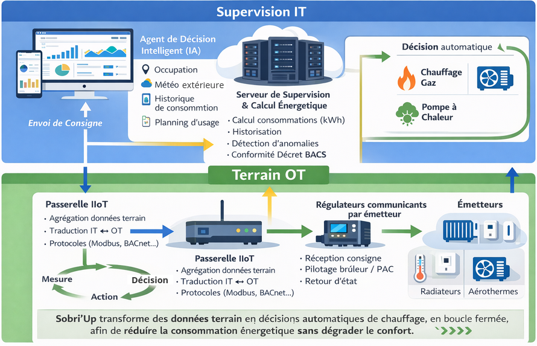
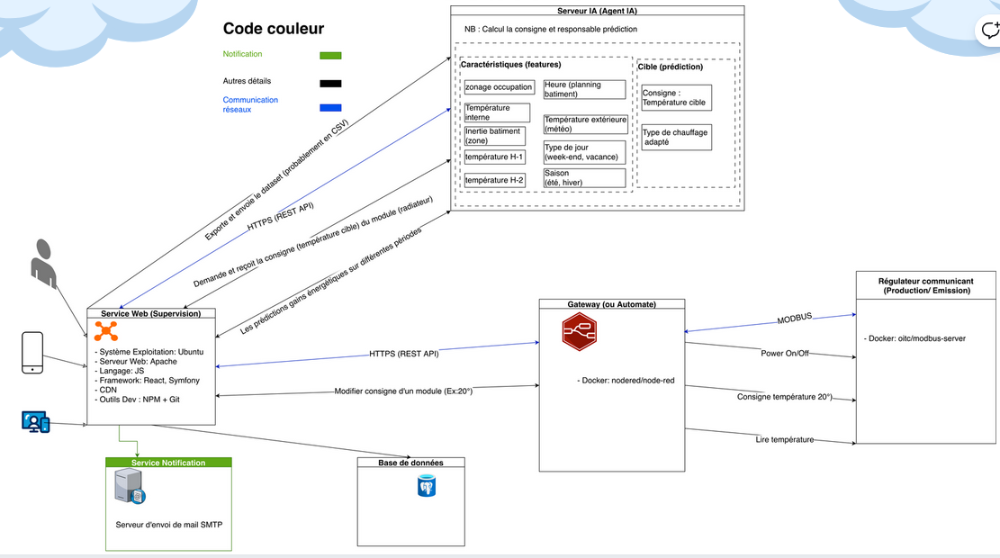
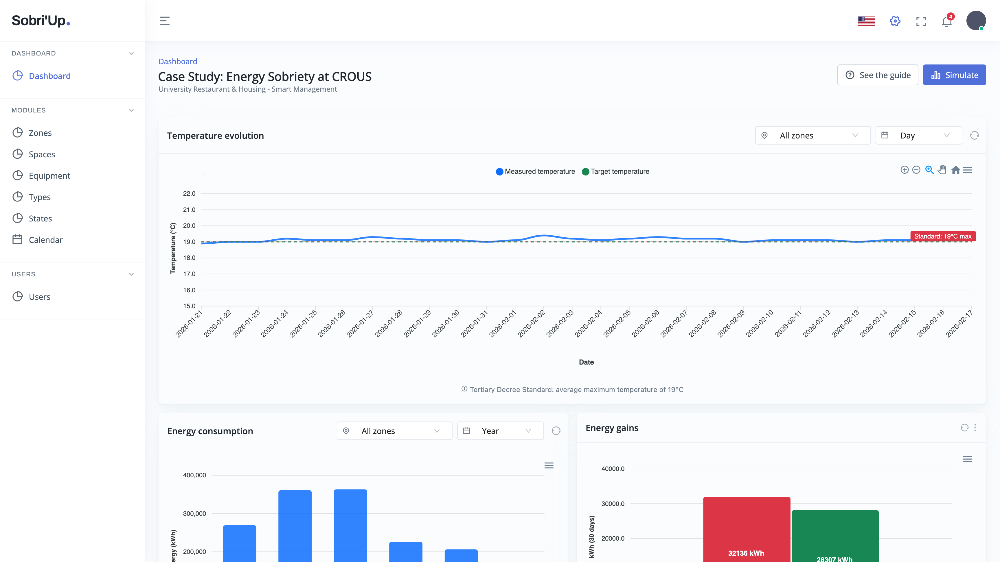
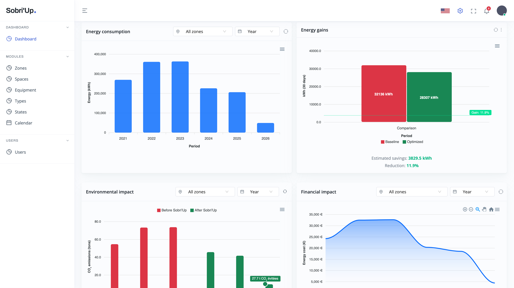
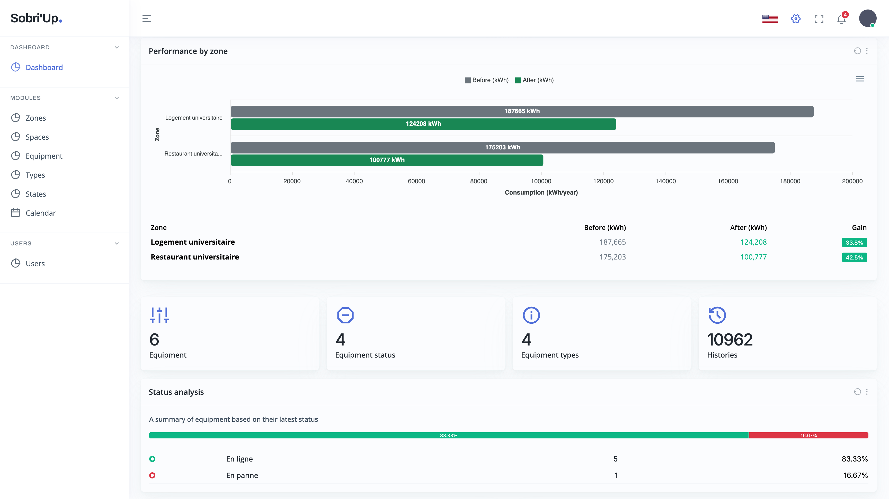
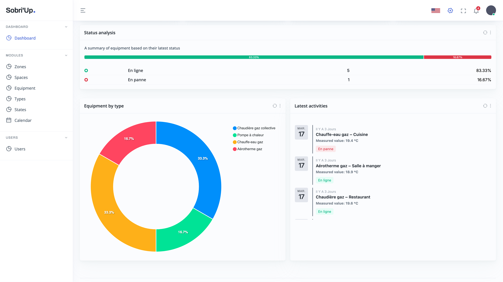

# Sobri'Up - Intelligent Energy Supervision Platform

**Sobri'Up** is an innovative energy supervision and control solution developed as part of the **Energy Sobriety Challenge** organized by **GRDF** via the **Agorize platform**.

Designed for tertiary buildings equipped with hybrid heating systems (gas + heat pumps), Sobri'Up combines IoT data collection, real-time energy analysis, and intelligent control to reduce energy consumption and CO₂ emissions while ensuring thermal comfort for users.

## Project Context

This project is part of an **energy sobriety** and **tertiary sector decarbonization** approach, in response to regulatory requirements (Tertiary Decree, BACS Decree) and energy transition challenges.

**Sobri'Up** was selected among the **top 10 proposals** out of over 100 projects submitted to the challenge and received technical mentorship from GRDF.

---

## Main Features

### Supervision & Monitoring
- **Real-time dashboard**: Visualization of energy consumption, measured vs target temperatures, equipment status
- **Multi-zone tracking**: Student housing, university restaurant, and other spaces
- **Performance indicators**: Consumption (kWh), costs (€), CO₂ emissions, ROI
- **Dynamic charts**: Time evolution with filters by period (day/week/month/year) and zone

### Intelligent Notification System
- **Real-time notifications**: Instant alerts via Mercure for critical events (failures, overconsumption)
- **Contextual notifications**:
    - ☀️ **Weather**: Recommendations based on Open-Meteo API (reduce heating if temp ≥ 15°C)
    - 🌙 **Schedules**: Optimization according to occupancy (night, off-peak hours)
    - 🔴 **Failures**: Automatic detection of equipment malfunctions
    - 📈 **Overconsumption**: Alerts if exceeding +20% vs 30-day average
- **Automatic emails**: Sent to administrators for critical and high-priority events
- **Custom interface**: Dropdown with counter badge, color-coded avatars, relative time formatting

### 🤖 Intelligent Control
- **AI decision agent**: Automatically calculates target temperature setpoints and manages dynamic arbitration between gas heating and heat pump (PAC)
- **Dynamic optimization**: Adaptation based on occupancy, weather, schedules, consumption history
- **Regulatory compliance**: Compliance with 19°C max standard (Tertiary Decree)

### 🔧 IoT Equipment Management
- **Module creation**: Add new equipment via form
- **Real-time monitoring**: Operating status, uptime, number of data points
- **Automatic simulation**: Symfony command to generate realistic states and values

### 📈 Analysis & Reporting
- **Interactive charts**: ApexCharts with advanced filters
- **Before/after comparison**: Energy savings, financial savings, CO₂ reduction
- **Performance by zone**: Consumption comparison Housing vs Restaurant
- **Temporal pagination**: Navigation by time windows (page 1 = recent period, page 2 = previous period, etc.)

### ⚙️ Automation
- **Symfony Scheduler**: Automatic periodic checks (every hour)
- **Scheduled tasks**:
    - Intelligent recommendations generation
    - Old notifications cleanup (>30 days read)
    - Daily report to administrators (8 AM)

---

## Screenshots & Architecture





### Supervision Interfaces







---

## Prerequisites

- [pnpm](https://pnpm.io/fr/)
- [Docker](https://www.docker.com/)

## Quick Installation (using Docker)

After installing PNPM and Docker, ensure they are working correctly, then follow these steps:

### For Linux and macOS

`make` commands are available to simplify installation and setup:

- **Clone the repository:**
    ```bash
    git clone https://github.com/PicassoHouessou/sobriup
    cd sobriup
    ```

- **Complete Installation**: Run the following command to install all dependencies (Composer and pnpm) and generate the
  database:

  ```bash
  make install
  ```

This command will set everything up. Open your web browser and navigate to **https://localhost** to access the application.
Please use **localhost** instead of 127.0.0.1.

- **Database Generation**: (Optional) If you have already installed the dependencies and only want to regenerate the database, run the following command. By default, you don't need to run this command because SQLite is used for the database and the file is already provided:

  ```bash
  make data
  ```

## Detailed Installation (Not required — for those who want more details)

### 1. Clone the repository

```bash
git clone https://github.com/PicassoHouessou/sobriup
cd sobriup
```

### 2. Install PHP dependencies

```bash
composer install
```

### 3. Install JavaScript dependencies with pnpm or yarn

```bash
pnpm install
```

### 4. Compile assets

For the development environment, run:

```bash
pnpm run dev-server
```

For the production environment, run:

```bash
pnpm run build
```

### 5. Configure the environment

**By default, you don't need to configure anything

Copy the `.env` file and adjust the configuration parameters (database, etc.):

```bash
cp .env .env.local
```

Modify `.env.local` as needed.

### 6. Create the database and run migrations

```bash
make console doctrine:database:drop # Delete the database
make console doctrine:database:create # Create the database
make console doctrine:migrations:migrate # Run the migration
```

### 7. Load fixtures

```bash
make console hautelook:fixtures:load --no-interaction # Generate the fixtures
```

### 8. Start the development server

```bash
make up
```

Please use **localhost** instead of 127.0.0.1.
Eg: https://localhost

### 9. The notification server
The PHP container, include the Mercure server

### 9. Run the simulation command

To simulate the values and statuses of the modules, run the following command:

```bash
make console app:module:simulate
```

You can automate this command with a cron job for periodic execution.

## Usage

- Access the web interface via the URL provided by the Symfony server.
- Use the form to add new modules.
- View the status and values of the modules on the monitoring page.
- Receive notifications in case of module malfunctions.


## Technologies Used

### Backend
- **Framework**: PHP 8.3, Symfony 7.4
- **ORM**: Doctrine
- **API**: API Platform, RESTful
- **Real-time**: Mercure (push notifications)
- **Scheduling**: Symfony Scheduler + Messenger
- **Database**: SQLite (dev), PostgreSQL/MySQL (prod)

### Frontend
- **Framework**: React 18, TypeScript
- **UI**: React Bootstrap, Ant Design
- **State**: Redux Toolkit (RTK Query)
- **Charts**: ApexCharts
- **Icons**: RemixIcon
- **Bundler**: Webpack Encore

### IoT & Data
- **Protocols**: Modbus, BACnet (compatible)
- **Weather**: Open-Meteo API (free, no key required)
- **Simulation**: Faker (realistic data generation)

### DevOps
- **Containerization**: Docker, Docker Compose
- **Tools**: Composer, pnpm, Symfony CLI

---

## Results & Impact

Based on simulations conducted on a typical CROUS site:

- **Gas consumption reduction**: -20% to -35%
- **Energy savings**: -10% to -20% on total bill
- **CO₂ emissions reduction**: Significant (estimated 19-86 tonnes CO₂ avoided)
- **ROI**: Fast return on investment through existing equipment optimization

